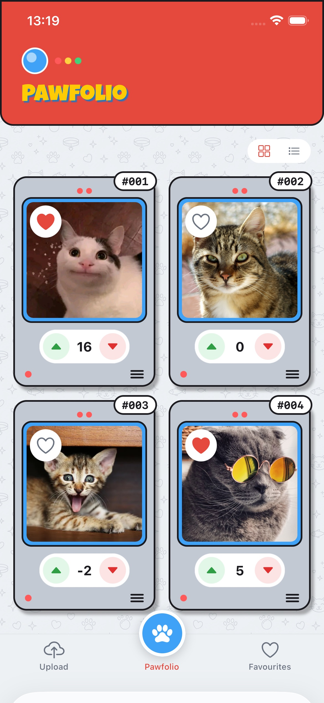
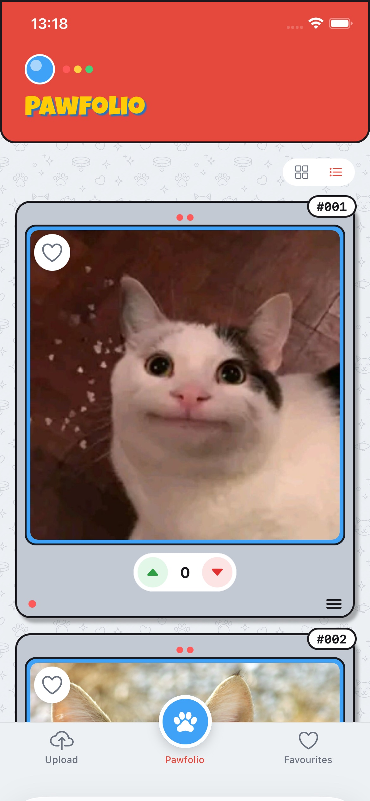
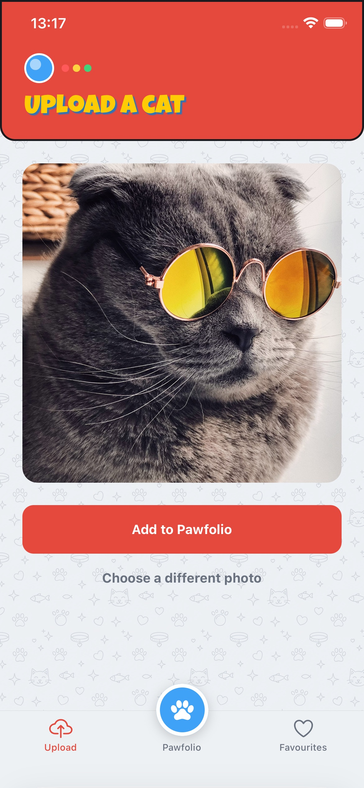
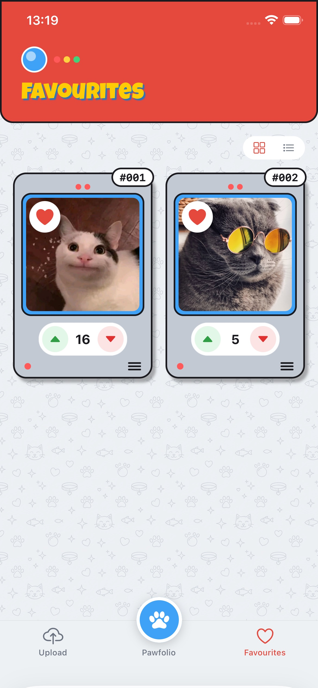

# Pawfolio 🐾

*Your finest felines, rated and adored.*

A cat-rating app built with **Expo + React Native + TypeScript** against [TheCatApi](https://thecatapi.com): upload cats, browse them in a responsive grid, favourite them, and vote them up or down with live scores. One codebase — iOS, Android, and web.

## Screenshots

<p>
  
  
  
  
</p>

## Quick start

Needs Node 20+, npm, and a free CatApi key ([thecatapi.com](https://thecatapi.com) — emailed instantly).

```bash
npm install
cp .env.example .env.local   # then paste your API key in
npm start
```

Checks: `npm test` (jest) · `npx tsc --noEmit` (types) · `npm run lint` (eslint).

## Requirements mapping

| Requirement | Where |
|---|---|
| 1. Upload at `/upload` | `src/app/upload.tsx` → normalise to JPEG → `POST /images/upload`, API errors shown verbatim, success returns to `/` |
| 2. List uploads at `/` | `src/app/index.tsx` → responsive grid, max 4 columns, scales to 340px, never stretched (`contentFit="cover"`) |
| 3. Favourite / unfavourite | Heart per card → `POST /favourites` / `DELETE /favourites/:id`, optimistic |
| 4. Vote up / down | Pill per card → `POST /votes` with value ±1 |
| 5. Score per cat | Sum of vote values, computed client-side from `GET /votes` |

Beyond the spec: a **Favourites tab** and **delete** (long-press a card → confirm). Favourites or votes pointing at a deleted image are dropped by the join — a case the tests pin down.

## Architecture

```
screens (src/app)            – render state, fire callbacks; no business logic
  └─ hooks (src/hooks)       – React Query: caching, mutations, optimistic updates
      └─ data (src/data)     – buildCatCards: the pure client-side join
          └─ api (src/api)   – typed CatApi modules, zod-validated responses
              └─ client.ts   – one axios instance: auth header + sub_id interceptor
```

- **The join.** No "my cats with favourites and score" endpoint exists, so `buildCatCards` joins the three flat lists by `image_id` (a LEFT JOIN + GROUP BY in TypeScript) into render-ready cards — pure, HTTP-free, and the most-tested code here.
- **Ownership without auth.** Uploads and favourites are tied to the account key, so every ownership request carries a per-device `sub_id` (a persisted UUID) to scope "*my* cats." Votes are deliberately unscoped.
- **Optimistic updates.** Hearts and votes apply instantly, then reconcile — snapshot, guess, roll back on error. The ceremony lives once in `useOptimisticListMutation`.

## Decisions & trade-offs

- **Votes accumulate, by design.** A playful toy, not a ballot. The API upserts one vote per `sub_id`, so each tap sends a fresh `sub_id` and the score is the running total (verified against the live API).
- **Normalise, don't gatekeep.** TheCatApi rejects HEIC — every iPhone photo — so each pick is transcoded to a right-sized JPEG before upload rather than refused; server errors still surface verbatim.
- **Heart locks, votes don't.** A favourite's delete needs the id its create returns, so the heart disables (~300ms) in flight; votes are independent appends, so rapid taps are safe.
- **Zod at the boundary**, validating only the fields the app consumes.
- **Votes paginate exhaustively** — vote rows are unbounded, so the score would cap at the API's 100-row page limit without the loop in `listAllVotes`.
- **Platform-forked upload** — RN's FormData takes a `{uri, name, type}` descriptor, browsers need a real Blob; `uploadImage` handles both.

## Known limitations

- **Delete is long-press only** — no visible affordance (relies on the accessibility hint).
- **Uploads always re-encode**, even an already-small JPEG.
- **Rollbacks are silent** — a toast explaining *why* the heart snapped back would be kinder.
- **Image list caps at 100** (a TODO in `images.ts`); icon and splash are still Expo defaults.

## Testing

The join — the one place with real logic — has 7 unit tests (`src/data/cat-cards.test.ts`) via jest-expo: empty inputs, zero-match defaults, mixed-vote summing, per-cat independence, favourite attachment, orphaned rows. UI and API layers are thin enough to verify by inspection and manual testing across iOS / Android / web.
